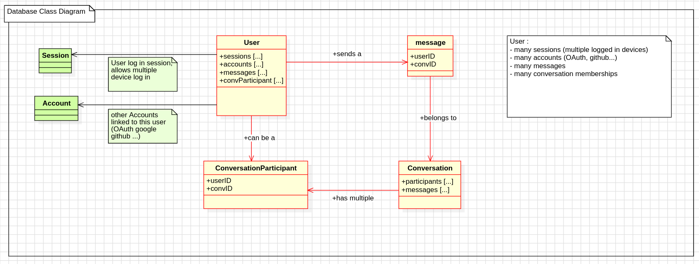
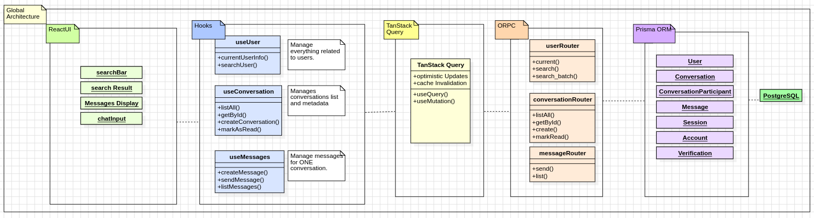

<p align="center">
  A modern full-stack messaging platform built with TypeScript,
  TanStack Start, Expo, PostgreSQL and WebSockets.
</p>

<p align="center">


</p>

<p align="center">
  
</p>


## Overview

VoidX is a centralized messaging platform designed around end-to-end type safety, real-time communication, and cross-platform code sharing.

The project demonstrates how a modern TypeScript stack can be used to build a scalable messaging application while remaining extensible toward future distributed, trust-minimized, or decentralized architectures.

The system is designed to be extensible toward real-time scalable or decentralized architectures in the future.

### Goals

* Full-stack TypeScript architecture
* Real-time messaging via WebSockets
* Authentication and authorization
* Shared business logic between web and mobile clients
* Type-safe API communication
* Extensible architecture for future scalability


## Tech Stack
- Web Frontend : Tanstack start
- Native Frontend : Expo + unwind
- Backend : Fullstack TanStack Start
- Runtime : None
- API : oRPC
- Database : PostgreSQL
- ORM : Prisma
- DB Setup : Docker
- Web Deploy : None
- Auth : better-auth
- Payments : None
- Package Manager : pnpm
- Addons : turborepo, Ruler

---

# Architecture

## Data Model



### Important Relationships

* A **User** can belong to many conversations.
* A **Conversation** contains many participants.
* A **ConversationParticipant** acts as the junction table between users and conversations.

---

## System Architecture Flow



---

# Setup

## 1. Development Environment

Run the database, web application, and mobile application locally.

```bash
# Start PostgreSQL container
docker compose up -d postgres

# Start web and mobile applications
pnpm run dev
```

## 2. Production Environment

Run the web application and database using Docker.

```bash
docker compose up -d
```

## 3. Database Reset / Rebuild

Reset the database, recreate the schema, and regenerate Prisma artifacts.

```bash
pnpm run db:fresh
```

## 4. Restart TypeScript Server (VS Code)

Useful when TypeScript types become out of sync.

```text
Ctrl + Shift + P
> TypeScript: Restart TS Server
```


# Features

## Backend & Architecture

- Prisma database models fully implemented
- oRPC type-safe API layer
- SOCKETS : using WebSocket real-time messaging system
- Dockerized PostgreSQL setup
- Shared types between frontend and backend
- Authentication system (better-auth)

## Shared Hooks System

Located in:
- `/packages/hooks/hooks.ts`
- `/packages/hooks/websocket/`

### Available Hooks

- **useUser** : authentication state, user search, batch user fetching
- **useMessages** :message fetching, optimistic message sending, pagination support (cursor-based)
- **useConversations** : conversation listing, unread count computation, create conversation, mark as read (optimistic update)
- **useConversationStream** :WebSocket subscription, real-time message updates


### Design Principles

1. Shared Hooks

Hooks are shared between both Web and Mobile applications.

API access is centralized through:

```text
/packages/api/src/routers/chat
```

This guarantees identical behavior and business logic across platforms.

2. Optimistic Updates

Messages and conversation state are updated immediately in the UI before server confirmation to provide a responsive user experience.

Example implementation:

```text
hooks.ts → addMessage()
```


# Web Application

## Features

- Database seeding via UI.
- Real-time WebSocket messaging
- Search users & conversations
- Lastread bubble and last message timestamp
- Persistent routing via cid in URL
- Welcome page with SEO referencing.


## Dev Tools
see `/apps/web/src/dev/dev-seed.tsx`

--> Automated database seeding using a simple Prima authClient script.
- To reset and re-generate the database : `pnpm run db:fresh`


## WebSocket Architecture

### API Definition & Hook Implementations
Located in :
-  api websocket definition :`/packages/api/src/routers/websocket/websocket.ts`
- see hooks implementation : `/packages/hooks/websocket`

### Features
- starts a websocket server on port 4001 (docker must also expose this port)
- API functions directly implement WS functions to subscribe to sockets so they can be notified when a specifi event happens (message_sent...)
- Websocket Server is started inside : `/apps/web/src/routes/api/rpc/$.ts`

---
# Mobile Application

Built with Expo + shared hooks system.

## Features

- Full messaging experience identical to web
- Real-time WebSocket updates
- Conversation navigation via URL params (cid)
- Cross-platform shared business logic

## Location Sharing (Mobile Specific Feature)

Users can share their current location directly inside conversations.

### Features
- Share current GPS location in chat
- Automatically generate a Google Maps link
- Send it as a normal message via existing pipeline

Implementation inside : `/apps/native/utils/location.ts`

Uses:
- expo-location
- permission-based access
- integrates directly into send() system


---

# TODO & Future Improvements

## Architecture

* Offline message queueing
* Push notifications (Expo Notifications)
* File-sharing (images, PDFs, videos)
* Horizontal scaling support


## Messaging Features
- Allow user to create a new conversation by searching other user's email.
- and/or do it via QR-code.
* Typing indicators
* Message reactions

## User Experience

* Emoji support
* User avatars
* Profile customization
* Settings page
* Theme selection


## License

Copyright (C) 2026

VoidX is licensed under the GNU Affero General Public License v3.0 (AGPL-3.0).

You are free to use, modify, and distribute this software under the terms
of the AGPL-3.0 license.

If you distribute modified versions or run modified versions as a public
network service, you must make the corresponding source code available
under the same license.

See the [LICENSE](LICENSE) file for the full license text.


